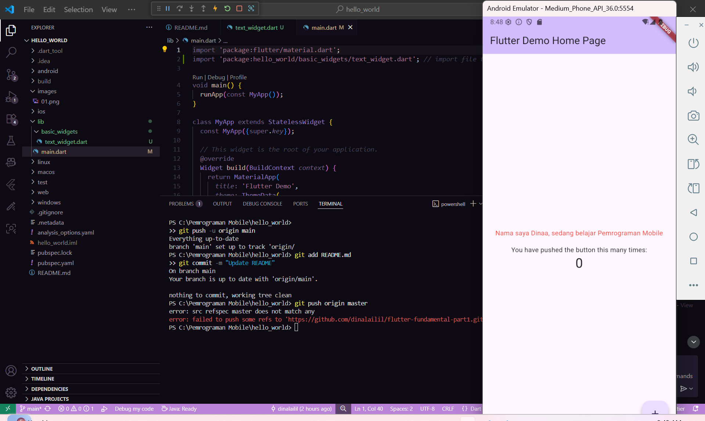
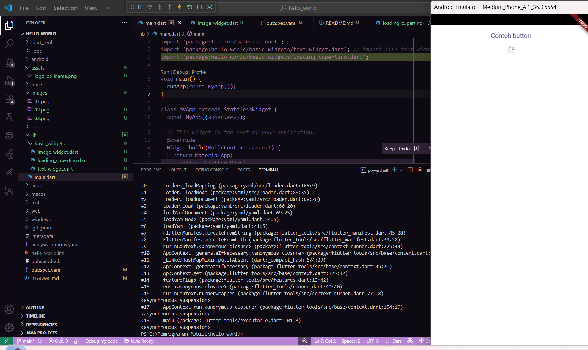
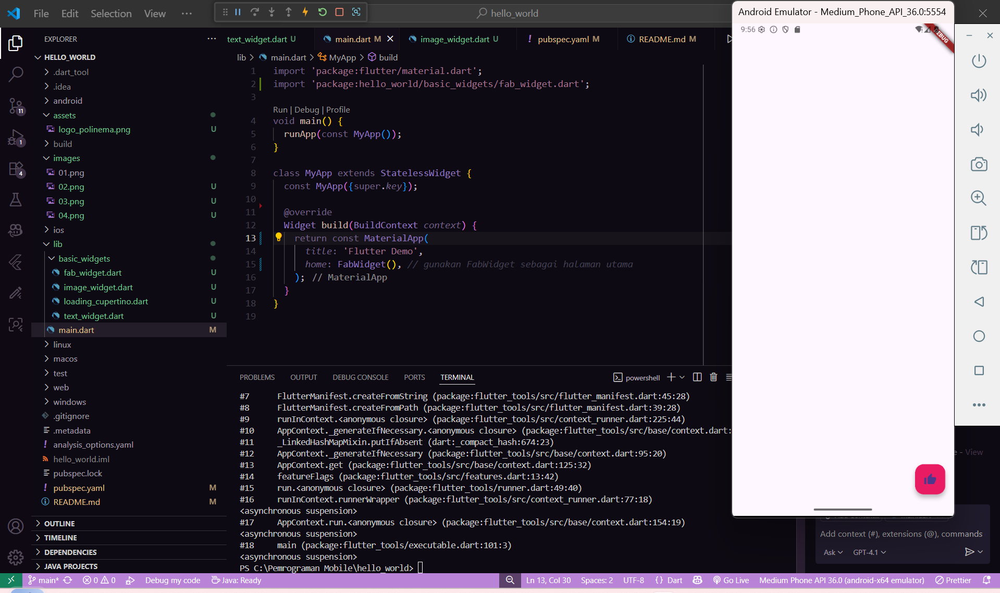

# hello_world

A new Flutter project.
1. praktikum 3 (Langkah awal untuk memulai aplikasi Flutter, menghasilkan template default counter app.)

2. praktikum 4 (Menampilkan gambar dari assets atau internet.)

3. praktikum 5 (Menampilkan indikator loading, biasanya untuk proses menunggu data.)

 (Tombol bulat melayang yang biasanya digunakan untuk aksi utama (contoh: tambah data).)
 (Struktur dasar aplikasi Flutter (AppBar, Body, FloatingActionButton, Drawer, dsb).)
 (Menampilkan pop-up pesan atau konfirmasi di layar.)
 (Widget untuk menerima input dari pengguna (misalnya TextField, Checkbox, Radio, Dropdown).)
 (Widget untuk memilih tanggal dan jam, memudahkan input waktu.)
